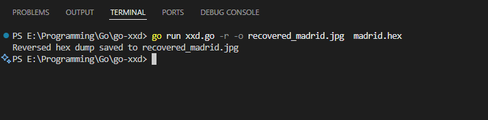

# Go XXD Tool 🖥️

A simple **hex dump utility in Go**, inspired by the Unix `xxd` command, capable of generating hex dumps and reversing them back to the original binary. Works for text, PDFs, images, and other binary files.

---

## Features ✨

* **Hex dump of any file**: Converts a file into a human-readable hex format.
* **Reverse mode (`-r`)**: Converts a hex dump back to the original file.
* **Custom output file**: Specify the output filename with `-o`.
* **Default behavior**:

  * Hex dump: adds `.hex` extension to the input file if `-o` is not specified.
  * Reverse mode: removes `.hex` from input filename; otherwise prepends `recovered_`.
* **Supports binary files**: Safely handles PDFs, images, and other non-text files.
* **Portable**: Saves outputs in the current folder.

---

## Installation

Make sure you have **Go installed**. Clone or copy the `xxd.go` file.

```bash
git clone <repo-url>
cd go-xxd
```

---

## Usage 🛠️

### 1. Hex dump — default output

```powershell
go run xxd.go myfile.pdf
```

* Output: `myfile.pdf.hex`
* Hex dump saved in the current folder.

---

### 2. Hex dump — custom output

```powershell
go run xxd.go -o dump.hex myfile.pdf
```

* Output: `dump.hex`
* Works for any file type.

---

### 3. Reverse hex dump — default output

```powershell
go run xxd.go -r dump.hex
```

* Strips `.hex` from filename: output `dump`
* Works for binary files, but you may need to **manually add the extension** (e.g., `.pdf`, `.jpg`) if the original extension is required.

---

### 4. Reverse hex dump — custom output

```powershell
go run xxd.go -r -o recovered.pdf dump.hex
```

* Output: `recovered.pdf`
* **Recommended for binary files** to ensure correct file type.

---

## Important Note ⚠️

For **binary files (PDFs, images, etc.)**, always specify the correct **output filename with extension** in reverse mode using `-o`. Otherwise, the restored file may not have the proper extension, even though the contents are correct.

---

## Example Workflow

1. Create hex dump (default):

```powershell
go run xxd.go -o linux.hex linux-commands.pdf
```

2. Reverse hex dump with custom output:

```powershell
go run xxd.go -r -o linux.pdf linux.hex
```

---

## 💻 Screenshots

### Create Hex Dump


### Hex Dump File


### Reverse Hex Dump



### Reverse Hex Dump - Recovered Original File


---

## 📄 License

This project is licensed under the [MIT License](https://opensource.org/licenses/MIT).
